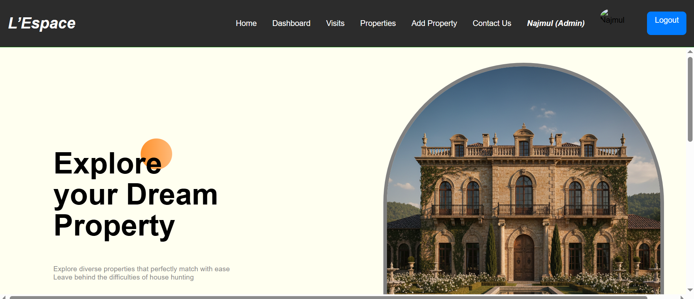
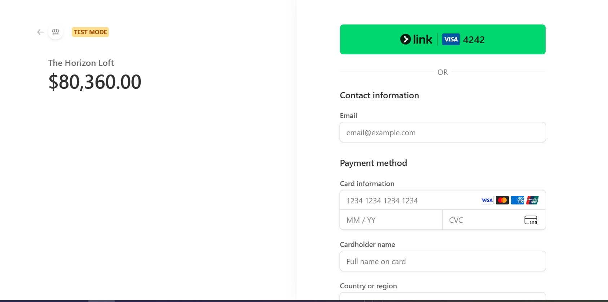

# 🏠 Real Estate Management System

A full-stack **MERN** project exploring both frontend & backend development.  
Built with **MongoDB, Express, React, Node.js, and Tailwind CSS**.

This system allows users to browse and purchase properties, make secure payments via **Stripe**, generate invoices, and manage everything through an **admin panel**.

---

## 📸 Screenshots

| Dashboard | Properties Page |
|----------|------------------|
|  |  |

| Property Details | User Registration |
|------------------|-------------------|
|  |  |

| Payment Gateway | Admin Panel |
|-----------------|------------|
|  |  |

| Purchase History | Add Property |
|------------------|-------------|
|  |  |

---

## ✨ Features

### 👤 For Users
- User Registration & Login (Authentication)
- Browse Properties in grid layout
- View Property Details (price, location, rating, discount)
- Rate Properties
- Purchase Properties via Stripe
- Download Invoice after payment
- View Purchase History

### 🔐 For Admin
- Admin Dashboard
- Add New Properties (with images)
- Edit Existing Properties
- Delete Properties (with confirmation)
- View All Properties
- View All Transactions

---

## 🛠️ Tech Stack

| Frontend | Backend | Database | Other |
|---------|---------|----------|------|
| React.js | Node.js | MongoDB | Stripe |
| Tailwind CSS | Express.js | - | Multer |

---
1. Install backend dependencies
cd server
npm install

2. Install frontend dependencies
cd client
npm install

3. Environment Variables

Create a .env file inside the server folder:

MONGODB_URI=your_mongodb_connection_string
STRIPE_SECRET_KEY=your_stripe_secret_key
JWT_SECRET=your_jwt_secret

👥 User Roles
| Role      | Permissions                                              |
| --------- | -------------------------------------------------------- |
| **Admin** | Add, edit, delete properties, view all transactions      |
| **User**  | Browse, rate, purchase properties, view purchase history |

